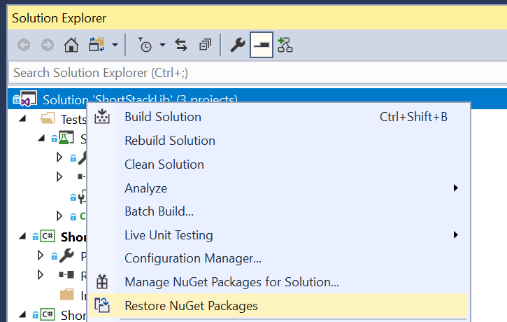
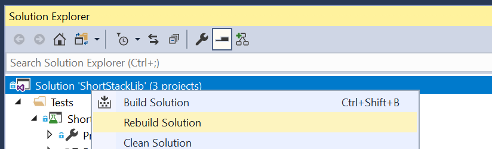
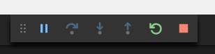
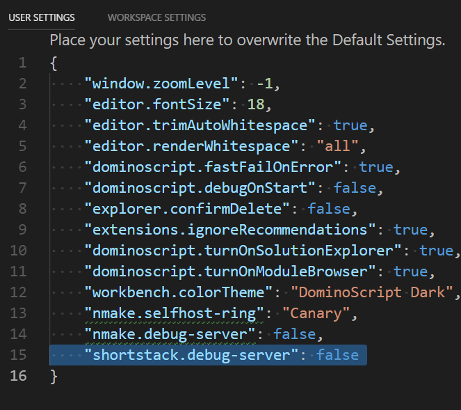

# ShortStack Extension for VS Code

## Development Instructions
The development process for VSCode extensions is actually quite simple once you perform a few prerequisite steps.

# __Node Package Manager__
Extensions for VSCode are written in Type-Script and leverage Node.JS libraries. In order to download the libraries for this extension, you will first need to install [Node Package Manager](https://www.npmjs.com). Install the version that is [recommended](https://nodejs.org/dist/v8.11.3/node-v8.11.3-x64.msi) for most users.

## __Install or update Node Libraries__
The next step is to install the node libraries for the extension. This is done by running:
```cmd
cd <shortStackRepo>\src\VSCodeExtension
npm -install
```
This will read the Node.JS dependencies from the [package.json](./package.json) file and install the necessary packages into the [node_modules](./node_modules) directory.

It may be necessary to perform this step after switching branches as others may have added new Node dependencies.

# __Building the ShortStack Server__
## Selecting the proper configuration
The ShortStack VS Code extension uses [JSON-RPC](https://www.jsonrpc.org/specification) to communicate with an out of process .Net server. The server needs to be built before the extension can launch and communicate with it.

Open the [ShortStack solution]((../server/shortStack.sln)) and select the  __Debug__ and __AnyCPU__ configuration.


## Restoring NuGet packages
Restore the NuGet packages for the solution as it uses many other 1st and 3rd party packages. This is especially important after switching branches as others may have added new references.



## Build the ShortStack server
Next, build the ShortStack server solution. You may optionally clean the solution if you have just switched branches.



# __Developing the ShortStack VS Code extension__
The development environment for a VS Code extension is VS Code itself. To start the development environment simply run:
```cmd
cd <shortStackRepo>\src\VSCodeExtension
code .
```
This will launch VS Code in the proper environment and you are ready to edit and debug.

## Debugging the VS Code ShortStack extension
After making edits, you can simply press __F5__ or choose __Debug\Start Debugging__ from the menu. Just like Visual Studio, you will see any compilation errors before it allows debugging.

### __Extension Development Host__
When debugging of an extension starts, it launches a new instance of VS Code that is the __Extension Development Host__. There will be two instances of VS Code running. The __development environment__ and the __extension development host__. The __extension development host__ is clearly labeled in the title bar.


This environment is used to interact with the ShortStack extension while under development.

In the __development environment__ there will be a "debug bar" that can be used to break, step, etc.



Use the __Extension Development Host__ to interact with the ShortStack extension.

Use the __development environment__ for settings breakpoints and stepping through the code.


# Running the ShortStack server in debug mode
It is often necessary to debug .Net ShortStack server while developing the VS Code extension. Without this, it would be nearly impossible to diagnose the JSON-RPC protocol.

To enable this, from the __Extension Development Host__ environment start the user preferences editor by pressing __Ctrl+Shift+P__ and type __"Open User Preferences"__.  This will display a a JSON file that contains the settings for the user.

Enable the __"shortstack.debug-server"__ option. After enabling this, you will need to close the __Extension Development Host__ and start debugging again. This will cause the ShortStack server to issue a debugger launch as soon as it starts. It is advised that you already have the ShortStack solution loaded so you can attach the ShortStack server process to an already running instance of Visual Studio (otherwise it will be necessary to launch a new instance of Visual Studio every time).

